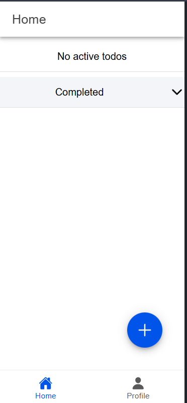
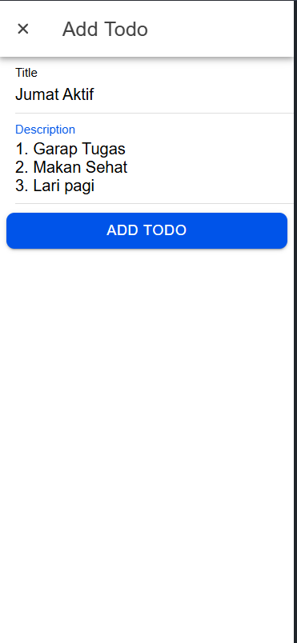
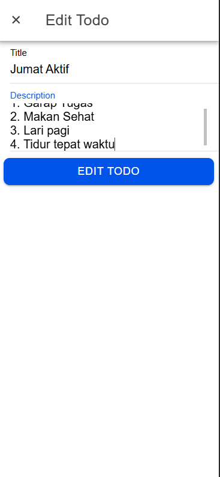
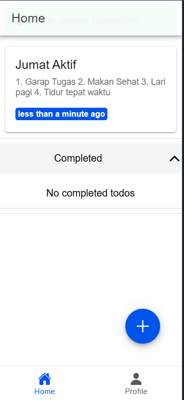
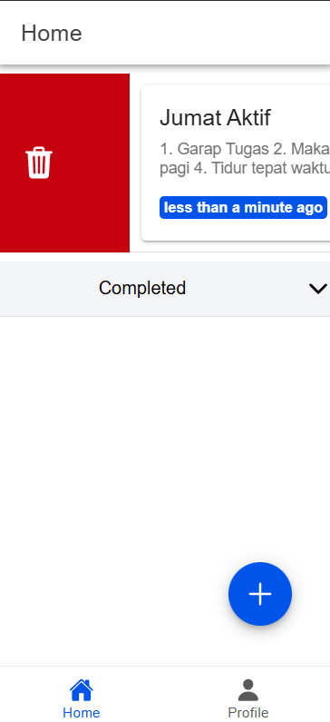
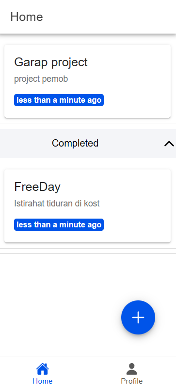

# Alur Autentikasi Google
- Repo Wianata Barus
- H1D022029
- Shift Baru F
- Shift KRS C

### **1. Inisialisasi Aplikasi Vue**  
Proses dimulai dengan inisialisasi aplikasi menggunakan `createApp`. Fungsi ini membuat instance aplikasi Vue, yang menjadi dasar seluruh komponen dan fitur lainnya. 


```typescript
import { createApp } from 'vue';
import App from './App.vue';
```

- **Penjelasan**:
  - `createApp`: Membuat aplikasi Vue baru.
  - `App.vue`: Komponen root yang akan dirender pertama kali.

---

### **2. Konfigurasi Router**  
Router diatur agar aplikasi dapat memiliki navigasi antar halaman. File `router` diimpor dari folder `./router`, di mana konfigurasi jalur telah dibuat.

```typescript
import router from './router';
```

- **Penjelasan**:
  - Router mengatur navigasi aplikasi, memungkinkan pengguna berpindah antara halaman dengan URL yang berbeda.
  - Konfigurasi jalur halaman biasanya terletak di file `router/index.ts` atau sejenisnya.

---

### **3. Integrasi IonicVue**  
Aplikasi menggunakan library **IonicVue** untuk menyediakan komponen antarmuka pengguna (UI) seperti tombol, grid, dan lain-lain.


```typescript
import { IonicVue } from '@ionic/vue';

/* Core CSS required for Ionic components to work properly */
import '@ionic/vue/css/core.css';

/* Basic CSS for apps built with Ionic */
import '@ionic/vue/css/normalize.css';
import '@ionic/vue/css/structure.css';
import '@ionic/vue/css/typography.css';
```

- **Penjelasan**:
  - **IonicVue** adalah framework yang digunakan untuk membangun UI dengan tampilan modern dan responsif.
  - File CSS seperti `core.css` dan `normalize.css` memuat styling dasar untuk komponen Ionic.

---

### **4. Manajemen State dengan Pinia**  
Aplikasi mengintegrasikan **Pinia** untuk mengelola state global, memudahkan berbagi data antar komponen.


```typescript
import { createPinia } from 'pinia';
```

- **Penjelasan**:
  - **Pinia** memungkinkan aplikasi untuk menyimpan dan mengelola data yang digunakan di berbagai bagian aplikasi.
  - Contohnya: Data pengguna, status login, atau pengaturan aplikasi.

---

### **5. Mengatur Tema dengan Variabel CSS**  
File tema digunakan untuk mendefinisikan variabel warna, font, dan styling lain yang konsisten di seluruh aplikasi.


```typescript
import './theme/variables.css';
```

- **Penjelasan**:
  - Variabel ini digunakan untuk mengatur tampilan aplikasi, seperti warna primer, sekunder, dan sebagainya.

---

### **6. Membuat dan Menggunakan Aplikasi**  
Komponen yang telah diatur kemudian dihubungkan menggunakan fungsi `.use()`. Semua plugin seperti `IonicVue`, `Pinia`, dan `router` diintegrasikan ke aplikasi.

```typescript
const app = createApp(App)
  .use(IonicVue)
  .use(createPinia())
  .use(router);
```

- **Penjelasan**:
  - `app.use`: Menambahkan plugin atau library ke aplikasi Vue.

---

### **7. Mounting Aplikasi**  
Aplikasi dirender ke elemen HTML dengan ID `#app`. Router memastikan aplikasi siap sebelum proses mounting.

```typescript
router.isReady().then(() => {
  app.mount('#app');
});
```

- **Penjelasan**:
  - `router.isReady()`: Menunggu router menyelesaikan semua proses inisialisasinya.
  - `app.mount('#app')`: Merender aplikasi ke elemen HTML dengan ID `app`.

---

### **8. Root Component: App.vue**  
Komponen root aplikasi adalah `App.vue`, yang mendefinisikan kerangka utama.

```vue
<template>
  <ion-app>
    <ion-router-outlet />
  </ion-app>
</template>

<script setup lang="ts">
import { IonApp, IonRouterOutlet } from '@ionic/vue';
</script>
```

- **Penjelasan**:
  - `ion-app`: Container utama aplikasi berbasis Ionic.
  - `ion-router-outlet`: Tempat di mana halaman yang aktif akan dirender berdasarkan konfigurasi router.

---

### **Alur Kerja Aplikasi**
1. **Proses Dimulai di `main.ts`**:
   - Membuat aplikasi Vue dengan `createApp`.
   - Mengimpor komponen utama (`App.vue`), router, dan plugin seperti IonicVue dan Pinia.
   - Menyiapkan tema dengan variabel CSS.
   
2. **Router Siap**:
   - Router menyelesaikan proses inisialisasi untuk memastikan halaman awal dapat dirender.
   
3. **Aplikasi Dirender ke HTML**:
   - Setelah semua plugin diatur, aplikasi dirender ke elemen HTML dengan ID `app`.
   
4. **Navigasi Melalui Router**:
   - Komponen root `App.vue` menggunakan `ion-router-outlet` untuk menampilkan halaman yang sesuai berdasarkan URL.

---

## ScreenShot


# Dokumentasi Aplikasi Todo dengan Ionic dan Firebase


## Tampilan Awal Setelah Login

[Tampilan Awal Setelah Login]

Pada tampilan awal ini, pengguna dapat melihat daftar Todo yang sedang aktif (belum selesai). Setiap Todo menampilkan **judul**, **deskripsi**, dan **waktu terakhir diperbarui**. Fitur ini mencakup komponen berikut:
- **IonList**: Menampilkan daftar Todo.
- **IonItemSliding**: Menyediakan opsi untuk menghapus atau mengedit Todo dengan swipe.
- **IonFab**: Tombol mengambang untuk menambah Todo baru.

---

## Tampilan Tambah Data

![Tampilan Tambah Data]  

Saat tombol tambah ditekan, sebuah modal muncul untuk memasukkan data baru. Modal ini menggunakan komponen **IonModal** dengan:
- **IonInput** untuk memasukkan judul Todo.
- **IonTextarea** untuk memasukkan deskripsi Todo.
- Tombol "Add Todo" untuk menambahkan data baru ke Firestore.

Kode terkait:
```ts
const handleSubmit = async (todo: Omit<Todo, 'id' | 'createdAt' | 'updatedAt' | 'status'>) => {
  if (!todo.title) {
    await showToast('Title is required', 'warning', warningOutline);
    return;
  }
  try {
    await firestoreService.addTodo(todo as Todo);
    loadTodos();
  } catch (error) {
    await showToast('An error occurred', 'danger', closeCircle);
  }
};
```

---

## Tampilan Edit Data

![Tampilan Edit Data]


Pengguna dapat mengedit Todo dengan memilih opsi "Edit" pada daftar Todo. Tampilan modal akan terbuka dengan data Todo yang sudah ada. Setelah data diperbarui, Todo akan di-update di Firestore.

Kode terkait:
```ts
const handleEdit = async (editTodo: Todo) => {
  editingId.value = editTodo.id!;
  todo.value = {
    title: editTodo.title,
    description: editTodo.description,
  }
  isOpen.value = true;
};
```

---

## Tampilan Delete Data

![Tampilan Delete Data] 

Todo dapat dihapus dengan cara swipe ke kanan atau memilih opsi "Delete" pada **IonItemSliding**. Setelah dihapus, Todo akan dihapus dari Firestore dan daftar diperbarui secara otomatis.

Kode terkait:
```ts
const handleDelete = async (deleteTodo: Todo) => {
  try {
    await firestoreService.deleteTodo(deleteTodo.id!);
    loadTodos();
  } catch (error) {
    console.error('Failed to delete todo:', error);
  }
};
```

---

## Tampilan Update Status

![Tampilan Update Status]

Status Todo dapat diperbarui menjadi **selesai** atau **aktif** dengan memilih opsi "Mark as Completed" atau "Mark as Active". Status ini diupdate di Firestore, dan daftar diperbarui.

Kode terkait:
```ts
const handleStatus = async (statusTodo: Todo) => {
  try {
    await firestoreService.updateStatus(statusTodo.id!, !statusTodo.status);
    loadTodos();
  } catch (error) {
    console.error('Failed to update status:', error);
  }
};
```

---

## Tampilan Complete Todo

![Tampilan Complete Todo]

Todo yang sudah selesai akan ditampilkan di bagian "Completed". Pengguna dapat membuka bagian ini menggunakan **IonAccordionGroup**. Todo yang selesai tetap dapat dihapus atau diubah statusnya kembali menjadi aktif.

Kode terkait:
```html
<ion-accordion-group>
  <ion-accordion value="completed">
    <ion-item slot="header" color="light">
      <ion-label>Completed</ion-label>
    </ion-item>
    <ion-list slot="content">
      <ion-item-sliding v-for="todo in completedTodos" :key="todo.id">
        <!-- Item Todo yang sudah selesai -->
      </ion-item-sliding>
    </ion-list>
  </ion-accordion>
</ion-accordion-group>
```

---

